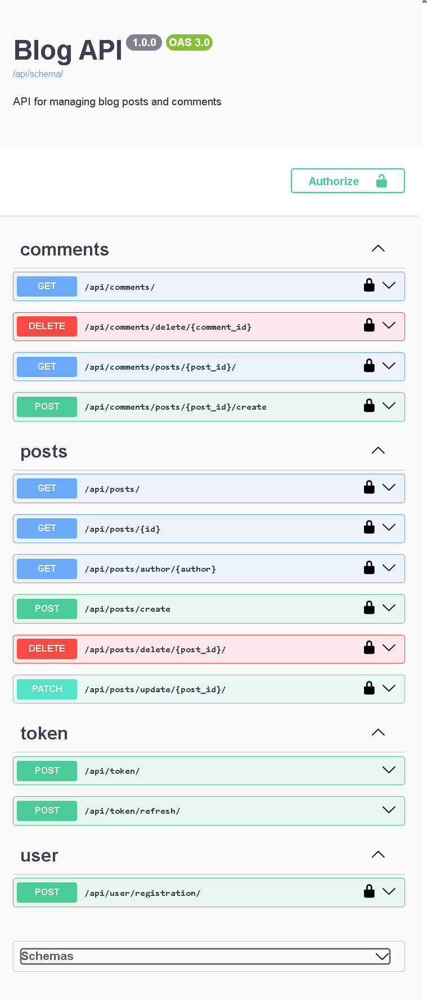

# blog-django-api

This Blogs API allows clients to consume a blog service. For now only post and comment operation endpoints are implemented. However, new features could be added in the future.

This service was built with: Django Framework, Django-Rest-Framework, SimpleJWT and drf_spectacular to generate the swagger documentation.

Feel free to create your user and test it yourself [here](http://146.235.60.74:8181/api/docs/). 

